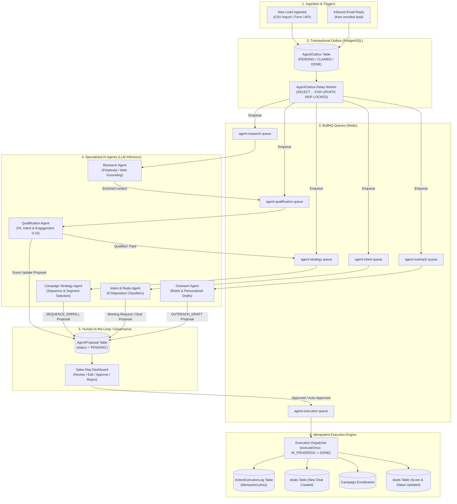
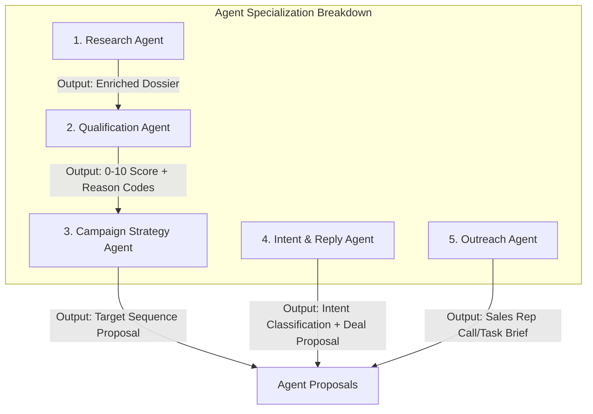
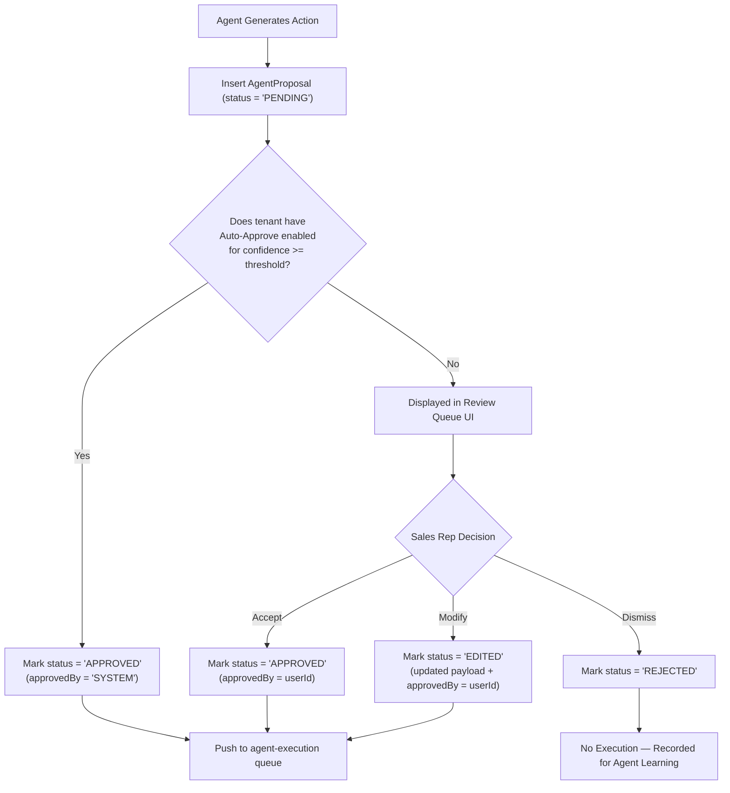
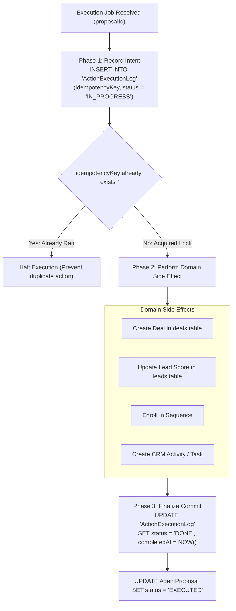

# Pipeclose Agentic Layer — End-to-End Architecture & Deep Dive

The **Agent Layer** in Pipeclose is an asynchronous, multi-agent AI system that powers autonomous sales research, lead qualification, sequence routing, inbound email reply classification, and deal creation. 

It is designed with a strict **Safety-First Principle**: agents do not directly mutate mission-critical CRM entities (e.g. creating deals or firing outbound emails) without going through a durable **Proposal & Idempotency Pipeline** that supports both automated and human-in-the-loop approvals.

---

## Table of Contents
1. [Core Design Philosophy](#1-core-design-philosophy)
2. [End-to-End Lifecycle Flowchart](#2-end-to-end-lifecycle-flowchart)
3. [The Asynchronous Backbone & Plumbing](#3-the-asynchronous-backbone--plumbing)
4. [Deep Dive: The 5 Specialized Agents](#4-deep-dive-the-5-specialized-agents)
   - [4.1 Research Agent](#41-research-agent)
   - [4.2 Qualification Agent](#42-qualification-agent)
   - [4.3 Campaign Strategy Agent](#43-campaign-strategy-agent)
   - [4.4 Intent & Reply Agent](#44-intent--reply-agent)
   - [4.5 Outreach Agent](#45-outreach-agent)
5. [The Human-in-the-Loop Proposal Engine](#5-the-human-in-the-loop-proposal-engine)
6. [3-Phase Idempotent Execution Engine](#6-3-phase-idempotent-execution-engine)
7. [Observability, Token Tracking & Safety Guardrails](#7-observability-token-tracking--safety-guardrails)

---

## 1. Core Design Philosophy

1. **Proposals Over Direct Mutations**: Rather than immediately executing dangerous side effects, agents produce `AgentProposal` records in a `PENDING` state. Reps can approve, edit, or reject them.
2. **Transactional Outbox Pattern**: Agent tasks are durably recorded in PostgreSQL (`AgentOutbox`) before being enqueued onto Redis/BullMQ. If the agent worker or Redis restarts, zero jobs are lost.
3. **Dedicated Process Isolation (`NODE_ROLE=agent`)**: The agent layer runs as its own standalone OS process (`src/agent.ts`), isolated from the HTTP web server (`src/server.ts`) and the background email/calendar workers (`src/worker.ts`).
4. **Three-Phase Idempotency**: Every executed action undergoes a strict `IN_PROGRESS -> side_effect -> DONE` lifecycle to prevent duplicate operations (such as sending duplicate emails or creating duplicate deals).

---

## 2. End-to-End Lifecycle Flowchart

The following flowchart illustrates how a prospect traverses the entire agentic pipeline, from ingestion to deal proposal:



---

## 3. The Asynchronous Backbone & Plumbing

The agent infrastructure is built on 4 resilient components:

### 3.1 The `AgentOutbox` Table
Instead of pushing directly to Redis (which can drop jobs during network hiccups), domain services insert rows into `AgentOutbox`:
```sql
CREATE TABLE "AgentOutbox" (
    "id" TEXT PRIMARY KEY,
    "companyId" INTEGER NOT NULL,
    "queue" TEXT NOT NULL,          -- 'research', 'qualification', 'intent', etc.
    "status" TEXT NOT NULL,         -- 'PENDING', 'IN_PROGRESS', 'DONE', 'FAILED'
    "payload" JSONB NOT NULL,
    "attempts" INTEGER DEFAULT 0,
    "createdAt" TIMESTAMP NOT NULL
);
```

### 3.2 The Outbox Relay (`agentOutboxRelay.ts`)
A dedicated background loop in `src/agent.ts` continually polls the outbox:
1. Performs `SELECT ... FOR UPDATE SKIP LOCKED` across pending rows.
2. Scopes write operations to the specific tenant companies.
3. Pushes jobs onto BullMQ queues with `jobId = outbox.id`.
4. Marks the outbox row as `IN_PROGRESS`.

### 3.3 The BullMQ Queues
The system registers 6 distinct Redis queues managed by [`agentQueueRegistry.ts`](file:///Users/adityaappnox/Documents/pipeclose/pipeclose-backend/src/modules/agent-layer/services/agentQueueRegistry.ts):
- `agent-research`: Gathers company context and executive information.
- `agent-qualification`: Evaluates company fit and calculates lead scores.
- `agent-strategy`: Decides the appropriate outreach campaign sequence.
- `agent-intent`: Analyzes incoming email replies.
- `agent-outreach`: Generates contextual briefing notes and call prep.
- `agent-execution`: Carries out approved proposals.

---

## 4. Deep Dive: The 5 Specialized Agents



### 4.1 Research Agent ([`researchAgent.ts`](file:///Users/adityaappnox/Documents/pipeclose/pipeclose-backend/src/modules/agent-layer/services/researchAgent.ts))
- **Trigger**: New lead created without full enrichment data.
- **Tools**: Perplexity API / Groq Web Search inference.
- **Job**: 
  - Gathers company size, annual revenue range, tech stack, and recent company news.
  - Identifies executive seniority and decision-maker status.
  - Generates a structured JSON research dossier.
- **Handoff**: Pushes the enriched lead to the `agent-qualification` queue.

### 4.2 Qualification Agent ([`qualificationAgent.ts`](file:///Users/adityaappnox/Documents/pipeclose/pipeclose-backend/src/modules/agent-layer/services/qualificationAgent.ts))
- **Trigger**: Completed research dossier or lead activity update.
- **Scoring Engine**: Evaluates a strictly bounded **0–10 integer score**:
  - `engagementScore` (0–4): Email opens, clicks, website visits.
  - `fitScore` (0–3): ICP criteria (industry match, revenue band, company size).
  - `intentScore` (0–3): Content downloads, pricing visits, inbound replies.
- **Classification**:
  - `HOT`: Score ≥ 8
  - `WARM`: Score 5–7
  - `COLD`: Score 0–4
- **Safety Rule**: `fitScore` alone cannot exceed the `WARM` threshold without real engagement or intent. This prevents reps from being sent to prospect people who have never heard of the company.

### 4.3 Campaign Strategy Agent ([`campaignStrategyAgent.ts`](file:///Users/adityaappnox/Documents/pipeclose/pipeclose-backend/src/modules/agent-layer/services/campaignStrategyAgent.ts))
- **Trigger**: A lead that achieved a `WARM` or `HOT` qualification score.
- **Job**: Evaluates all active campaigns and sequences for the tenant.
- **Output**: 
  - Generates a `SEQUENCE_ENROLL` proposal detailing *which* sequence the lead should enter and *why*.
  - Alternatively produces a `SEGMENT_RECOMMENDATION` if no active sequence is an exact fit.

### 4.4 Intent & Reply Agent ([`intentReplyAgent.ts`](file:///Users/adityaappnox/Documents/pipeclose/pipeclose-backend/src/modules/agent-layer/services/intentReplyAgent.ts))
- **Trigger**: Inbound email reply from an enrolled prospect (routed by `inboundReplyOutbox.ts`).
- **Dispositions**: Classifies the reply into 1 of 9 exact intents:
  1. `meeting_request`: Explicit request to book a call or demo.
  2. `interested`: Positive sentiment, requesting more details or pricing.
  3. `objection`: Budget, timing, or competitor concerns.
  4. `referral`: "Talk to my colleague John."
  5. `wrong_person`: "I don't handle this."
  6. `not_now`: Timing bad, follow up in 6 months.
  7. `unsubscribe`: Unsubscribe / Do Not Contact.
  8. `ooo`: Out of office.
  9. `negative`: Hostile or uninterested.
- **Deal Conversion Trigger**: If intent is `meeting_request` or `interested`, the agent halts further sequence emails and generates a **`DEAL_CREATE`** proposal!

### 4.5 Outreach Agent ([`outreachAgent.ts`](file:///Users/adityaappnox/Documents/pipeclose/pipeclose-backend/src/modules/agent-layer/services/outreachAgent.ts))
- **Trigger**: When a campaign step is a manual task (e.g., discovery phone call or LinkedIn message).
- **Job**: Synthesizes the prospect's past emails, company research, and objections into a short, actionable **sales brief** (`OUTREACH_DRAFT`) for the rep to use during the call.

---

## 5. The Human-in-the-Loop Proposal Engine

Agents communicate through proposals. The proposal record stores:
- `id`: Unique UUID.
- `agentName`: e.g. `'IntentReplyAgent'`, `'QualificationAgent'`.
- `targetOperation`: e.g. `'DEAL_CREATE'`, `'SEQUENCE_ENROLL'`, `'LEAD_SCORE_UPDATE'`.
- `targetEntityId`: Lead ID or Contact ID.
- `proposedPayload`: JSON data to apply if approved.
- `reasoning`: Plain-text explanation of why the agent recommends this action.
- `confidence`: Confidence score (0.0 to 1.0).
- `status`: `'PENDING'`, `'APPROVED'`, `'EDITED'`, `'REJECTED'`, `'EXPIRED'`.



---

## 6. 3-Phase Idempotent Execution Engine

When a proposal is approved, it lands on the `agent-execution` queue handled by [`executionDispatcher.ts`](file:///Users/adityaappnox/Documents/pipeclose/pipeclose-backend/src/modules/agent-layer/services/executionDispatcher.ts) using the [`executeOnce()`](file:///Users/adityaappnox/Documents/pipeclose/pipeclose-backend/src/modules/agent-layer/services/executeOnce.ts) harness:



If a server crash occurs midway through execution, a retried job will find the existing `IN_PROGRESS` idempotency key and route it to recovery rather than duplicating the external action.

---

## 7. Observability, Token Tracking & Safety Guardrails

### 7.1 Prometheus Metrics Port (4002)
The agent process exports real-time metrics on `http://localhost:4002/metrics`:
- `agent_queue_depth`: Number of jobs waiting in each of the 6 agent queues.
- `agent_proposals_total`: Counter of proposals by status (`PENDING`, `APPROVED`, `REJECTED`).
- `agent_execution_latency_ms`: Time taken from proposal approval to domain write.

### 7.2 LLM Token Usage & Cost Reconciliation
Implemented in [`llmTokenUsage.ts`](file:///Users/adityaappnox/Documents/pipeclose/pipeclose-backend/src/modules/agent-layer/services/llmTokenUsage.ts):
- Every call to Groq, OpenAI, or Perplexity logs prompt tokens, completion tokens, model name, and cost.
- Tenants have hard monthly AI credit limits to prevent runaway loops.

### 7.3 Tenant Scope Guard (`tenantScopeGuard.ts`)
When `NODE_ROLE=agent` is set, Prisma automatically wraps queries in a guard that enforces `companyId` filtering. An agent executing for Tenant A is cryptographically and logically blocked from reading or modifying data for Tenant B.
