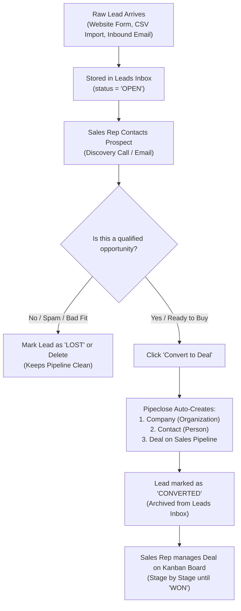
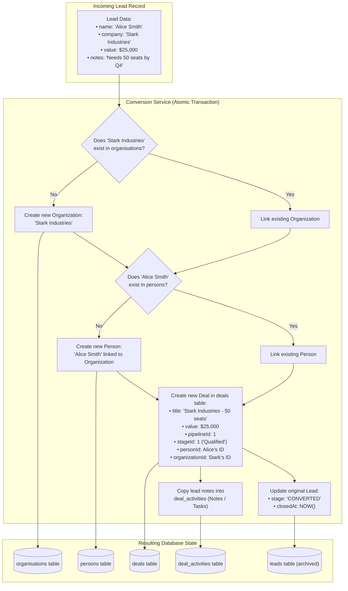

# Lead to Deal Workflow — A Beginner's Guide

Welcome to the team! If you just joined and are trying to wrap your head around what "Lead to Deal" means in Pipeclose (and in CRM software in general), this document is for you.

---

## 1. The Big Picture: Plain English Analogy

Think of a sales process like fishing:

```
[ A Ripple in the Water ]  ───>  [ Hooked Fish ]  ───>  [ Catch of the Day! ]
        LEAD                           DEAL                   WON DEAL
  (Raw Interest / Inquiry)     (Active Sales Process)     (Money in the Bank)
```

- **A Lead is an inquiry or raw contact.** Someone dropped their business card in a fishbowl, filled out a contact form, or signed up for a trial. You don't know yet if they have a real budget, if they are serious, or if they are a good fit.
- **A Deal is an active sales opportunity with money on the line.** You've talked to them, confirmed they are interested, and now you are actively negotiating stages: *Discovery Call -> Product Demo -> Proposal Sent -> Contract Signed*.

### Why not just make everything a "Deal" right away?
If you put every random website inquiry directly into your sales pipeline, your pipeline becomes cluttered with garbage, spam, and dead ends. Sales reps only want **qualified, high-probability opportunities** in their active pipeline board.

---

## 2. The Core Entities (The Players)

To understand the conversion, you need to know the 5 main database records involved:

| Entity | What it represents | Example |
| :--- | :--- | :--- |
| **Lead** | Unqualified prospect | `"John Doe from Acme Corp, interested in CRM software"` |
| **Person** | A permanent contact directory entry | `John Doe (john@acme.com, +1-555-0199)` |
| **Organization** | The company that pays the bills | `Acme Corp (50 employees, Technology)` |
| **Pipeline & Stage** | The sales conveyor belt | Pipeline: *"Enterprise Sales"*, Stage: *"Demo Scheduled"* |
| **Deal** | The money opportunity on the pipeline | `"$12,000 / year - Acme Expansion Deal"` |

---

## 3. High-Level Conceptual Flow

Here is what happens in the sales rep's world:



---

## 4. Technical Flow: Behind the Scenes in the Database

When the user clicks **"Convert to Deal"**, the backend takes the raw lead data and splits it into structured, relational CRM records:



---

## 5. Where Does This Code Live in Pipeclose?

Here is your map of the files in the repository related to this process:

```
pipeclose-backend/
├── src/
│   ├── modules/
│   │   ├── leads/                       <── The "Before" stage
│   │   │   ├── models/Lead.ts           (Database table for raw leads)
│   │   │   ├── services/leadService.ts  (Business logic for leads)
│   │   │   ├── controllers/leadController.ts
│   │   │   └── routes/leadRoutes.ts     (GET /api/leads, POST /api/leads)
│   │   │
│   │   ├── pipelines/                   <── The "After" stage (Deals)
│   │   │   ├── models/Deal.ts           (Database table for active deals)
│   │   │   ├── models/Pipeline.ts       (Pipelines: e.g. "Standard Sales")
│   │   │   ├── models/PipelineStage.ts  (Stages: "Lead In" -> "Demo" -> "Won")
│   │   │   ├── services/dealService.ts  (Complex deal creation & management)
│   │   │   └── routes/dealRoutes.ts     (POST /api/deals, PUT /api/deals/:id/stage)
│   │   │
│   │   └── management/                  <── The Permanent Directory
│   │       ├── persons/                 (Contacts table & service)
│   │       └── organisations/           (Companies table & service)
```

---

## 6. API Walkthrough (How the Frontend Calls It)

### Step 1: Rep Views the Lead
The frontend fetches the lead:
```http
GET /api/leads/42
Authorization: Bearer <JWT_TOKEN>
```
Response:
```json
{
  "id": 42,
  "name": "Bruce Wayne",
  "company": "Wayne Enterprises",
  "value": 100000,
  "notes": "Looking for cybersecurity fleet management",
  "stage": "OPEN"
}
```

### Step 2: Rep Clicks "Convert to Deal"
The frontend calls the conversion endpoint:
```http
POST /api/leads/42/convert-to-deal
Authorization: Bearer <JWT_TOKEN>
Content-Type: application/json

{
  "dealTitle": "Wayne Enterprises - Security Fleet",
  "pipelineId": 1,
  "stageId": 2,
  "expectedCloseDate": "2026-11-15"
}
```

### Step 3: Backend Executes the Conversion & Returns the Result
```json
{
  "success": true,
  "message": "Lead converted to deal successfully",
  "data": {
    "deal": {
      "id": 108,
      "title": "Wayne Enterprises - Security Fleet",
      "value": 100000,
      "currency": "USD",
      "pipelineId": 1,
      "stageId": 2,
      "personId": 15,
      "organizationId": 8,
      "status": "OPEN"
    },
    "organization": {
      "id": 8,
      "name": "Wayne Enterprises"
    },
    "person": {
      "id": 15,
      "name": "Bruce Wayne",
      "organizationId": 8
    }
  }
}
```

---

## 7. Common Questions & Edge Cases

### Q1: What happens if the Company already exists?
**Deduplication:** Before inserting `"Wayne Enterprises"`, the service searches existing organizations by name. If found, it links the existing `organizationId` rather than creating a duplicate company.

### Q2: What happens to the old Lead record?
**It is NOT deleted.** In sales, historical data is gold. We update the lead's status to `CONVERTED` and set `closedAt = NOW()`. This ensures:
- Analytics can still calculate lead conversion rates (`Converted Leads / Total Leads = Conversion %`).
- Marketing knows which source generated the deal.

### Q3: What happens to notes written on the Lead?
Any notes or logs attached to the lead are copied over as initial `deal_activities` (type = `'note'`). The sales rep never has to re-type what they already learned during the qualification call.

---

## 8. Summary Checklist for Developers

When working on or debugging the Lead-to-Deal phase, make sure:
1. [ ] **Atomic Transaction**: If creating the deal fails, don't leave a half-created person or company in the database.
2. [ ] **Preserve Context**: Always transfer notes and history from lead to deal.
3. [ ] **Validation**: Ensure target `pipelineId` and `stageId` exist before attempting conversion.
4. [ ] **Audit Trail**: Record a `deal_history` entry stating: `"Deal created from Lead #42"`.
