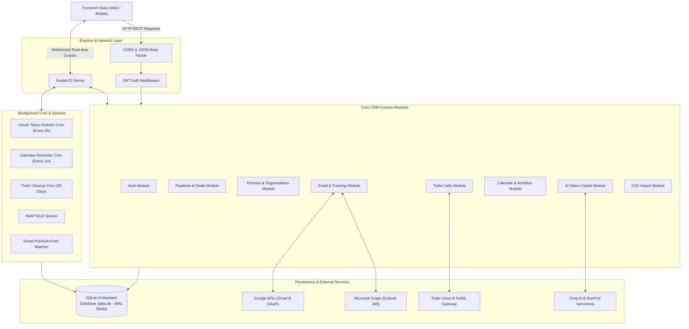
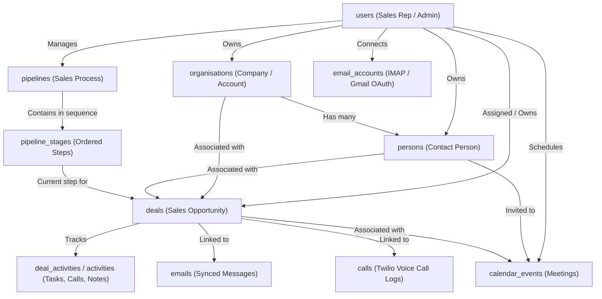
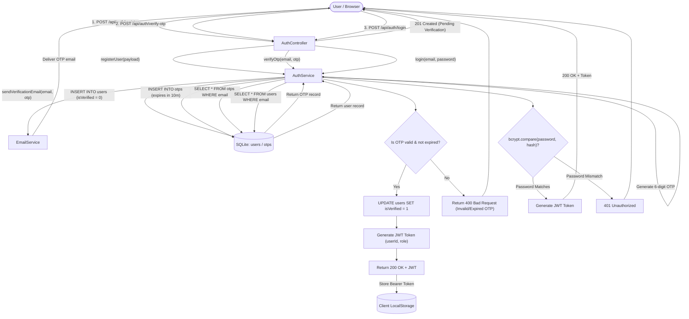
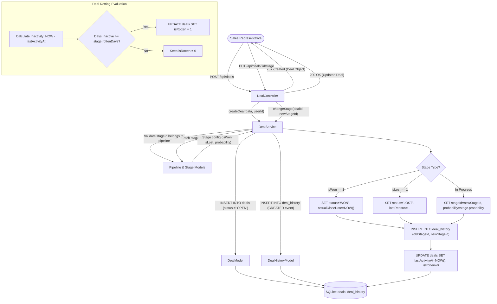
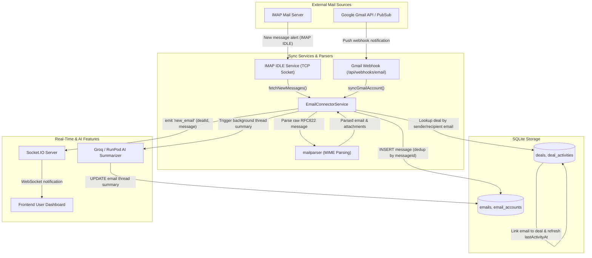
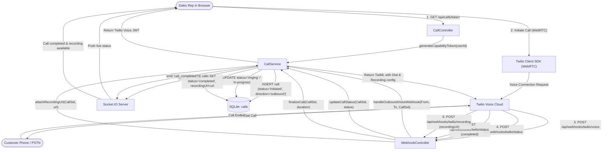
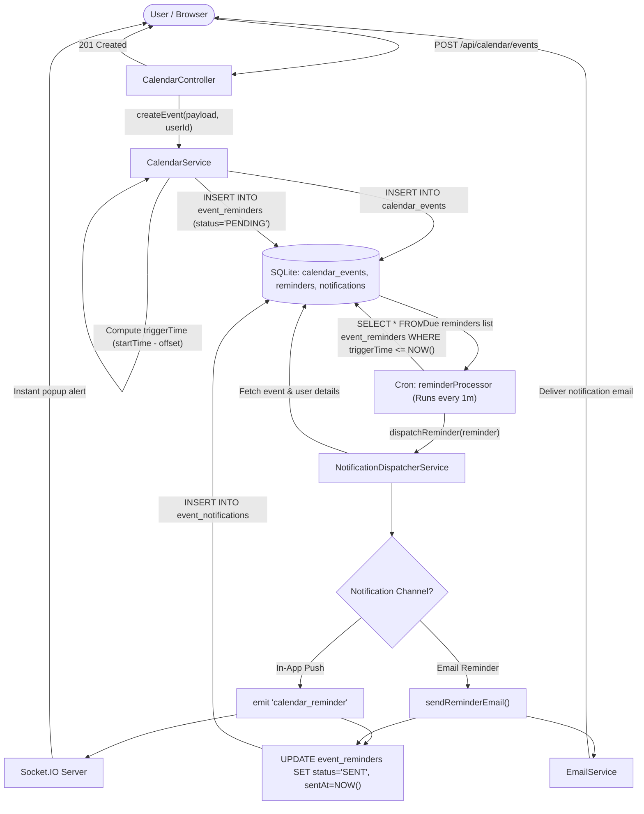
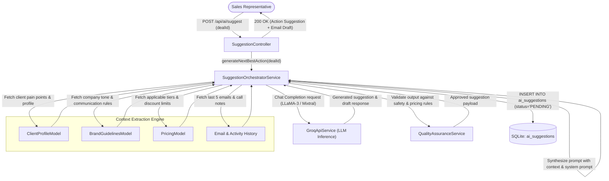
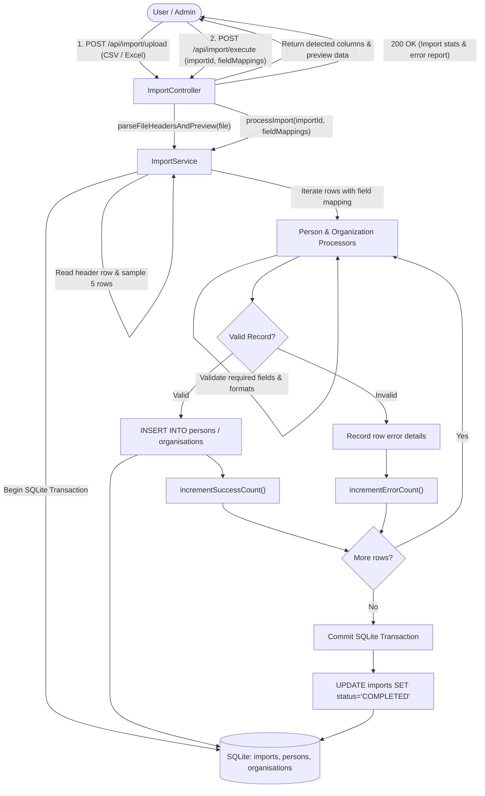

# Pipeclose Backend Documentation & Architecture

Pipeclose (*Mini CRM*) is an extensible, enterprise-ready Customer Relationship Management (CRM) backend built with Node.js, TypeScript, Express, Socket.IO, and SQLite. It provides pipeline sales tracking, two-way email synchronization, in-browser VoIP calling via Twilio, calendar scheduling, and an AI sales copilot.

---

## Table of Contents
1. [High-Level System Architecture](#1-high-level-system-architecture)
2. [Data Model & Entity Relationships](#2-data-model--entity-relationships)
3. [Authentication & Authorization Flow](#3-authentication--authorization-flow)
4. [Sales Pipeline & Deal Management Flow](#4-sales-pipeline--deal-management-flow)
5. [Two-Way Email Sync & Instant Notification Flow](#5-two-way-email-sync--instant-notification-flow)
6. [Telephony & WebRTC Calling Flow (Twilio)](#6-telephony--webrtc-calling-flow-twilio)
7. [Calendar & Reminder Processing Flow](#7-calendar--reminder-processing-flow)
8. [AI Sales Agent & Copilot Flow](#8-ai-sales-agent--copilot-flow)
9. [Bulk Data Import Flow](#9-bulk-data-import-flow)
10. [API Route Reference](#10-api-route-reference)

---

## 1. High-Level System Architecture

The application adopts a **Modular Monolith** architecture with layered separation of concerns (Route -> Controller -> Service -> Model) and an embedded SQLite database running with Write-Ahead Logging (WAL) mode.

---

## 2. Data Model & Entity Relationships

The relational model ties deals, contacts, companies, communications, and activities together:

---

## 3. Authentication & Authorization Flow

Pipeclose uses bcrypt password hashing and JWT authentication, backed by email-based One-Time Password (OTP) verification for registration and secure operations.

---

## 4. Sales Pipeline & Deal Management Flow

Pipelines model customizable sales processes. Deals move across stages with automatic win probability calculations, stage change audits, and rotten deal detection.

---

## 5. Two-Way Email Sync & Instant Notification Flow

The email module synchronizes mail via IMAP or Google/Microsoft OAuth, listens for incoming emails in real-time, extracts deal associations, and pushes alerts through WebSockets.

---

## 6. Telephony & WebRTC Calling Flow (Twilio)

The calls module enables browser-based outbound calling via Twilio Voice SDK, handles live call webhooks, stores dual-channel audio recordings, and pushes status updates.

---

## 7. Calendar & Reminder Processing Flow

The calendar module allows reps to organize meetings and tasks. A background cron worker checks every 60 seconds for due reminders and dispatches notifications via WebSockets or email.

---

## 8. AI Sales Agent & Copilot Flow

The AI Agent acts as an in-context sales copilot. It synthesizes client history, brand guidelines, and product pricing models to recommend the next best action or draft replies using Groq LLMs.

---

## 9. Bulk Data Import Flow

The data import module supports importing contacts, organizations, and leads via CSV or spreadsheet files with field mapping and transactional batch inserts.

---

## 10. API Route Reference

Below is a consolidated reference of the primary REST endpoints exposed by the server:

| Group | Route Prefix | Key Endpoints | Description |
| :--- | :--- | :--- | :--- |
| **Auth** | `/api/auth` | `POST /register`, `POST /login`, `POST /verify-otp`, `GET /me` | User registration, authentication, and session handling |
| **Pipelines** | `/api/pipelines` | `GET /`, `POST /`, `PUT /:id`, `DELETE /:id` | Sales pipelines configuration and ordering |
| **Deals** | `/api/deals` | `GET /`, `POST /`, `PUT /:id`, `PUT /:id/stage`, `DELETE /:id` | Sales opportunities, stage progression, and status updates |
| **Contacts** | `/api/persons` | `GET /`, `POST /`, `PUT /:id`, `DELETE /:id` | Individual customer contacts management |
| **Companies**| `/api/organisations`| `GET /`, `POST /`, `PUT /:id`, `DELETE /:id` | Organization profiles and linked company data |
| **Emails** | `/api/emails` | `GET /`, `POST /send`, `GET /threads`, `GET /accounts` | Multi-account email sync, composition, and threads |
| **Drafts** | `/api/email/drafts` | `GET /`, `POST /`, `PUT /:id`, `DELETE /:id`, `POST /:id/send` | Email composer drafts management |
| **Calls** | `/api/calls` | `GET /token`, `GET /logs`, `POST /call` | Twilio WebRTC token generation and call log access |
| **Webhooks** | `/api/webhooks` | `POST /twilio/voice`, `POST /twilio/status`, `POST /email` | External event ingestion from Twilio and Gmail Pub/Sub |
| **Calendar** | `/api/calendar` | `GET /events`, `POST /events`, `PUT /events/:id`, `DELETE /events/:id` | Event scheduling, reminders, and calendar sharing |
| **AI Copilot**| `/api/ai` | `POST /suggest`, `GET /config`, `PUT /config` | AI-assisted sales suggestions, brand guidelines, and pricing |
| **Import** | `/api/import` | `POST /upload`, `POST /execute`, `GET /status/:id` | Bulk CSV/Excel contact and deal ingestion |
| **Health** | `/api/health` | `GET /` | System health check and uptime status |
