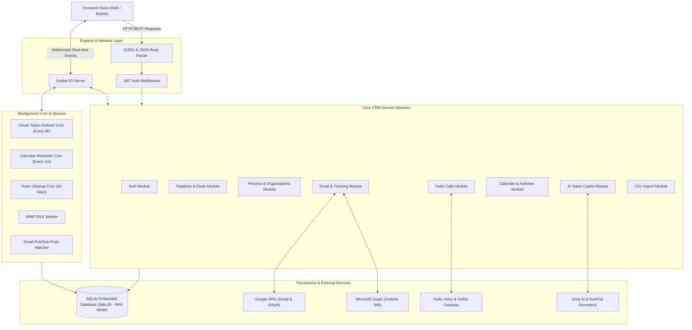
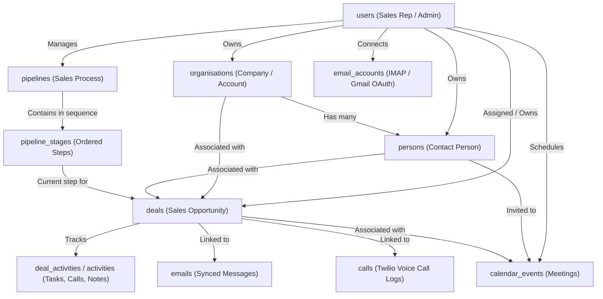

# Pipeclose Backend Documentation & Architecture

Pipeclose (*Mini CRM*) is an extensible, enterprise-ready Customer Relationship Management (CRM) backend built with Node.js, TypeScript, Express, Socket.IO, and SQLite. It provides pipeline sales tracking, two-way email synchronization, in-browser VoIP calling via Twilio, calendar scheduling, and an AI sales copilot.

---

## Table of Contents
1. [High-Level System Architecture](#1-high-level-system-architecture)
2. [Data Model & Entity Relationships](#2-data-model--entity-relationships)
3. [Authentication & Authorization Flow](#3-authentication--authorization-flow)
4. [Sales Pipeline & Deal Management Flow](#4-sales-pipeline--deal-management-flow)
5. [Two-Way Email Sync & Instant Notification Flow](#5-two-way-email-sync--instant-notification-flow)
6. [Telephony & WebRTC Calling Flow (Twilio)](#6-telephony--webrtc-calling-flow-twilio)
7. [Calendar & Reminder Processing Flow](#7-calendar--reminder-processing-flow)
8. [AI Sales Agent & Copilot Flow](#8-ai-sales-agent--copilot-flow)
9. [Bulk Data Import Flow](#9-bulk-data-import-flow)
10. [API Route Reference](#10-api-route-reference)

---

## 1. High-Level System Architecture

The application adopts a **Modular Monolith** architecture with layered separation of concerns (Route -> Controller -> Service -> Model) and an embedded SQLite database running with Write-Ahead Logging (WAL) mode.



---

## 2. Data Model & Entity Relationships

The relational model ties deals, contacts, companies, communications, and activities together:



---

## 3. Authentication & Authorization Flow

Pipeclose uses bcrypt password hashing and JWT authentication, backed by email-based One-Time Password (OTP) verification for registration and secure operations.

```mermaid
flowchart TD
    User([User / Browser])
    AuthCtrl[AuthController]
    AuthSvc[AuthService]
    EmailSvc[EmailService]
    UserDB[(SQLite: users / otps)]
    ClientStorage[(Client LocalStorage / Cookie)]

    %% Registration Flow
    User ->>|1. POST /api/auth/register (name, email, password)| AuthCtrl
    AuthCtrl ->> AuthSvc: registerUser(payload)
    AuthSvc ->> AuthSvc: Hash Password (bcrypt salt 10)
    AuthSvc ->> UserDB: Insert User (isVerified = 0)
    AuthSvc ->> AuthSvc: Generate 6-digit OTP code
    AuthSvc ->> UserDB: Save OTP (expires in 10 mins)
    AuthSvc ->> EmailSvc: sendVerificationEmail(email, otp)
    EmailSvc -->> User: Deliver OTP code to inbox
    AuthCtrl -->> User: 201 Created (Pending Verification)

    %% Verification Flow
    User ->>|2. POST /api/auth/verify-otp (email, otp)| AuthCtrl
    AuthCtrl ->> AuthSvc: verifyOtp(email, otp)
    AuthSvc ->> UserDB: Query & validate OTP expiration
    alt Valid OTP
        AuthSvc ->> UserDB: UPDATE users SET isVerified = 1
        AuthSvc ->> AuthSvc: Generate JWT Token (payload: userId, role)
        AuthCtrl -->> User: 200 OK + JWT Token + Profile
        User ->> ClientStorage: Store Bearer Token
    else Invalid or Expired
        AuthCtrl -->> User: 400 Bad Request (Invalid/Expired OTP)
    end

    %% Login Flow
    User ->>|3. POST /api/auth/login (email, password)| AuthCtrl
    AuthCtrl ->> AuthSvc: login(email, password)
    AuthSvc ->> UserDB: Find by email
    AuthSvc ->> AuthSvc: Compare bcrypt hash
    alt Password Matches
        AuthSvc ->> AuthSvc: Generate JWT Token
        AuthCtrl -->> User: 200 OK + JWT Token
    else Credentials Mismatch
        AuthCtrl -->> User: 401 Unauthorized
    end
```

---

## 4. Sales Pipeline & Deal Management Flow

Pipelines model customizable sales processes. Deals move across stages with automatic win probability calculations, stage change audits, and rotten deal detection.

```mermaid
flowchart TD
    Client([Sales Representative])
    DealCtrl[DealController]
    DealSvc[DealService]
    PipelineModel[Pipeline & Stage Models]
    DealModel[DealModel]
    HistoryModel[DealHistoryModel]
    DB[(SQLite: deals, deal_history)]

    %% Create Deal
    Client ->>|POST /api/deals (title, value, stageId, personId, orgId)| DealCtrl
    DealCtrl ->> DealSvc: createDeal(dealData, userId)
    DealSvc ->> PipelineModel: Validate stageId belongs to pipeline
    DealSvc ->> DealModel: INSERT INTO deals (status = 'OPEN', isRotten = 0)
    DealSvc ->> HistoryModel: Record Initial History Event
    DealCtrl -->> Client: 201 Created (Deal Object)

    %% Move Stage / Drag and Drop
    Client ->>|PUT /api/deals/:id/stage (newStageId)| DealCtrl
    DealCtrl ->> DealSvc: changeStage(dealId, newStageId, userId)
    DealSvc ->> DealModel: Fetch current deal details
    DealSvc ->> PipelineModel: Fetch new stage properties (probability, isWon, isLost)
    
    alt Stage is marked as WON
        DealSvc ->> DealModel: UPDATE deals SET status='WON', actualCloseDate=NOW()
    else Stage is marked as LOST
        DealSvc ->> DealModel: UPDATE deals SET status='LOST', lostReason=...
    else Regular Stage Progression
        DealSvc ->> DealModel: UPDATE deals SET stageId=newStageId, probability=stage.probability
    end

    DealSvc ->> HistoryModel: INSERT INTO deal_history (oldStageId, newStageId, changedAt)
    DealSvc ->> DealModel: Reset Rotten Status Timer (lastActivityAt = NOW())
    DealCtrl -->> Client: 200 OK (Updated Deal)

    %% Background Deal Rotting Logic
    subgraph DealRottingCheck ["Deal Rotting Evaluation (On Query / Cron)"]
        CheckTime["Current Time - deal.lastActivityAt"]
        Threshold{"Exceeds stage.rottenDays?"}
        SetRotten["UPDATE deals SET isRotten = 1"]
        ClearRotten["UPDATE deals SET isRotten = 0"]

        CheckTime --> Threshold
        Threshold -- Yes --> SetRotten
        Threshold -- No --> ClearRotten
    end
```

---

## 5. Two-Way Email Sync & Instant Notification Flow

The email module synchronizes mail via IMAP or Google/Microsoft OAuth, listens for incoming emails in real-time, extracts deal associations, and pushes alerts through WebSockets.

```mermaid
flowchart TD
    subgraph EmailSources ["External Mail Services"]
        IMAPServer["IMAP Mail Server"]
        Gmail["Google Gmail API / PubSub"]
    end

    subgraph SyncServices ["Backend Listeners & Processors"]
        ImapIdle["IMAP IDLE Service (Persistent TCP Socket)"]
        GmailPush["Gmail Webhook Handler (/api/webhooks/email)"]
        EmailConnector["EmailConnectorService"]
        Parser["mailparser (MIME Parsing)"]
    end

    subgraph DatabaseLayer ["Persistence"]
        EmailDB[(SQLite: emails, email_accounts)]
        DealDB[(SQLite: deals, deal_activities)]
    end

    subgraph RealtimeDelivery ["Real-time & AI"]
        SocketIO["Socket.IO Server"]
        Summarizer["RunPod / Groq Thread Summarizer"]
        FrontendClient["Frontend Client Dashboard"]
    end

    %% IMAP Flow
    IMAPServer -- "IMAP IDLE Event (New Message Added)" --> ImapIdle
    ImapIdle ->> EmailConnector: fetchNewMessages(account)

    %% Gmail Flow
    Gmail -- "Push Notification (Pub/Sub Webhook)" --> GmailPush
    GmailPush ->> EmailConnector: syncGmailAccount(account)

    %% Common Processing
    EmailConnector ->> Parser: Parse raw RFC822 message body & attachments
    Parser ->> EmailConnector: Structured Email (from, to, subject, html, text, threadId)
    EmailConnector ->> EmailDB: Save message (Deduplicate by messageId)

    %% Deal Linking
    EmailConnector ->> DealDB: Find deal by sender/recipient email address
    opt Linked Deal Found
        EmailConnector ->> DealDB: Link email ID to deal & update lastActivityAt
    end

    %% Trigger AI Summarization
    EmailConnector ->> Summarizer: Trigger async thread summary
    Summarizer ->> EmailDB: Store thread summary

    %% Real-time Notification
    EmailConnector ->> SocketIO: Emit 'new_email' event (payload: message, dealId)
    SocketIO -- Push Notification --> FrontendClient
```

---

## 6. Telephony & WebRTC Calling Flow (Twilio)

The calls module enables browser-based outbound calling via Twilio Voice SDK, handles live call webhooks, stores dual-channel audio recordings, and pushes status updates.

```mermaid
flowchart TD
    BrowserUser([Sales Rep in Browser])
    TwilioSDK["Twilio Client SDK (WebRTC)"]
    CallCtrl[CallController]
    WebhookCtrl[WebhookController]
    CallSvc[CallService]
    TwilioAPI["Twilio Voice Cloud"]
    CustomerPhone([Customer Phone / PSTN])
    SocketServer[Socket.IO Server]
    CallDB[(SQLite: calls)]

    %% Token Initialization
    BrowserUser ->>|1. GET /api/calls/token| CallCtrl
    CallCtrl ->> CallSvc: generateCapabilityToken(userId)
    CallSvc -->> BrowserUser: Return Twilio JWT Voice Token

    %% Outbound Dial
    BrowserUser ->>|2. Call Phone Number (WebRTC)| TwilioSDK
    TwilioSDK ->> TwilioAPI: Voice Connection Request
    TwilioAPI ->>|3. POST /api/webhooks/twilio/voice| WebhookCtrl
    WebhookCtrl ->> CallSvc: handleOutboundVoiceWebhook(From, To, CallSid)
    CallSvc ->> CallDB: Create Call Record (status = 'initiated', direction = 'outbound')
    CallSvc -->> TwilioAPI: Return TwiML (<Dial callerId="..." record="record-from-answer-dual">)

    %% Ringing Customer
    TwilioAPI ->> CustomerPhone: PSTN Outbound Call
    TwilioAPI ->>|4. POST /api/webhooks/twilio/status| WebhookCtrl
    WebhookCtrl ->> CallSvc: updateCallStatus(CallSid, 'ringing' / 'in-progress')
    CallSvc ->> CallDB: Update status
    CallSvc ->> SocketServer: Emit 'call_status' { callSid, status: 'in-progress' }
    SocketServer -- Push Event --> BrowserUser

    %% Call Completed & Recording
    CustomerPhone -- Hangs up --> TwilioAPI
    TwilioAPI ->>|5. POST /api/webhooks/twilio/status (completed, duration)| WebhookCtrl
    WebhookCtrl ->> CallSvc: finalizeCall(CallSid, duration)
    TwilioAPI ->>|6. POST /api/webhooks/twilio/recording (recordingUrl)| WebhookCtrl
    WebhookCtrl ->> CallSvc: attachRecordingUrl(CallSid, recordingUrl)
    CallSvc ->> CallDB: Update duration, status='completed', recordingUrl
    CallSvc ->> SocketServer: Emit 'call_completed'
    SocketServer -- Push Event --> BrowserUser
```

---

## 7. Calendar & Reminder Processing Flow

The calendar module allows reps to organize meetings and tasks. A background cron worker checks every 60 seconds for due reminders and dispatches notifications via WebSockets or email.

```mermaid
flowchart TD
    User([User])
    CalCtrl[CalendarController]
    CalSvc[CalendarService]
    CalDB[(SQLite: calendar_events, event_reminders, event_notifications)]
    CronWorker["Cron Job: reminderProcessor (Runs every 1 min)"]
    Dispatcher[NotificationDispatcherService]
    SocketServer[Socket.IO]
    EmailSvc[EmailService]

    %% Event Scheduling
    User ->>|POST /api/calendar/events (title, startTime, reminders: [15, 60])| CalCtrl
    CalCtrl ->> CalSvc: createEvent(eventData, userId)
    CalSvc ->> CalDB: INSERT INTO calendar_events
    loop For each reminder offset
        CalSvc ->> CalDB: Calculate triggerTime = startTime - offset minutes
        CalSvc ->> CalDB: INSERT INTO event_reminders (triggerTime, status = 'PENDING')
    end
    CalCtrl -->> User: 201 Created

    %% Background Cron Processing
    CronWorker ->> CalDB: SELECT * FROM event_reminders WHERE triggerTime <= NOW() AND status = 'PENDING'
    CalDB -->> CronWorker: Due Reminders List

    loop For each due reminder
        CronWorker ->> Dispatcher: dispatchReminder(reminder)
        Dispatcher ->> CalDB: Fetch Event & User Details
        
        alt In-App / Push Notification
            Dispatcher ->> SocketServer: Emit 'calendar_reminder' { eventTitle, startTime }
            SocketServer -- Live Alert --> User
        else Email Alert Requested
            Dispatcher ->> EmailSvc: sendReminderEmail(user.email, eventDetails)
            EmailSvc -- Deliver Email --> User
        end

        Dispatcher ->> CalDB: UPDATE event_reminders SET status = 'SENT', sentAt = NOW()
        Dispatcher ->> CalDB: INSERT INTO event_notifications (status = 'DISPATCHED')
    end
```

---

## 8. AI Sales Agent & Copilot Flow

The AI Agent acts as an in-context sales copilot. It synthesizes client history, brand guidelines, and product pricing models to recommend the next best action or draft replies using Groq LLMs.

```mermaid
flowchart TD
    Rep([Sales Rep])
    AICtrl[SuggestionController]
    Orchestrator[SuggestionOrchestratorService]
    
    subgraph ContextRetrieval ["Context Extraction Engine"]
        ClientProfileModel[ClientProfileModel]
        BrandModel[BrandGuidelinesModel]
        PricingModel[PricingModel]
        HistoryModel[Email & Activity History]
    end

    GroqService[GroqApiService / LLM Inference]
    QA[QualityAssuranceService]
    DB[(SQLite: ai_suggestions)]

    Rep ->>|POST /api/ai/suggest (dealId / threadId)| AICtrl
    AICtrl ->> Orchestrator: generateNextBestAction(dealId)
    
    %% Aggregating Context
    par Fetch Context In Parallel
        Orchestrator ->> ClientProfileModel: Get client industry, past pain points
        Orchestrator ->> BrandModel: Get company tone of voice & rules
        Orchestrator ->> PricingModel: Get eligible packages & pricing
        Orchestrator ->> HistoryModel: Get recent emails, call notes & stage
    end

    Orchestrator ->> Orchestrator: Assemble Structured Prompt (System Rules + Context)
    Orchestrator ->> GroqService: Request Chat Completion (e.g. LLaMA-3 / Mixtral)
    GroqService -->> Orchestrator: Generated Suggestion (action, draftReply, reasoning)
    
    Orchestrator ->> QA: Validate output (Ensure no hallucinations or forbidden pricing)
    QA -->> Orchestrator: Approved Suggestion
    
    Orchestrator ->> DB: INSERT INTO ai_suggestions (dealId, suggestion, status='PENDING')
    AICtrl -->> Rep: 200 OK + AI Suggestion & Editable Draft
```

---

## 9. Bulk Data Import Flow

The data import module supports importing contacts, organizations, and leads via CSV or spreadsheet files with field mapping and transactional batch inserts.

```mermaid
flowchart TD
    Admin([User / Admin])
    ImportCtrl[ImportController]
    ImportSvc[ImportService]
    Processor[Person / Org Processor]
    DB[(SQLite Database)]

    Admin ->>|1. POST /api/import/upload (CSV File)| ImportCtrl
    ImportCtrl ->> ImportSvc: parseFileHeadersAndPreview(file)
    ImportSvc -->> Admin: Return detected columns & row preview (Sample 5 rows)

    Admin ->>|2. POST /api/import/execute (importId, fieldMappings)| ImportCtrl
    ImportCtrl ->> ImportSvc: processImport(importId, fieldMappings)
    
    ImportSvc ->> ImportSvc: Open SQLite Transaction
    loop For each CSV record
        ImportSvc ->> Processor: Map CSV columns to Schema fields
        Processor ->> Processor: Validate format (valid email, required fields)
        alt Valid Record
            Processor ->> DB: INSERT / UPDATE entity
            ImportSvc ->> ImportSvc: incrementSuccessCount()
        else Invalid Record
            ImportSvc ->> ImportSvc: logError(rowNumber, reason)
        end
    end
    
    ImportSvc ->> ImportSvc: Commit Transaction
    ImportSvc ->> DB: UPDATE imports SET status='COMPLETED', successCount, errorCount
    ImportCtrl -->> Admin: 200 OK (Import Summary & Error Log)
```

---

## 10. API Route Reference

Below is a consolidated reference of the primary REST endpoints exposed by the server:

| Group | Route Prefix | Key Endpoints | Description |
| :--- | :--- | :--- | :--- |
| **Auth** | `/api/auth` | `POST /register`, `POST /login`, `POST /verify-otp`, `GET /me` | User registration, authentication, and session handling |
| **Pipelines** | `/api/pipelines` | `GET /`, `POST /`, `PUT /:id`, `DELETE /:id` | Sales pipelines configuration and ordering |
| **Deals** | `/api/deals` | `GET /`, `POST /`, `PUT /:id`, `PUT /:id/stage`, `DELETE /:id` | Sales opportunities, stage progression, and status updates |
| **Contacts** | `/api/persons` | `GET /`, `POST /`, `PUT /:id`, `DELETE /:id` | Individual customer contacts management |
| **Companies**| `/api/organisations`| `GET /`, `POST /`, `PUT /:id`, `DELETE /:id` | Organization profiles and linked company data |
| **Emails** | `/api/emails` | `GET /`, `POST /send`, `GET /threads`, `GET /accounts` | Multi-account email sync, composition, and threads |
| **Drafts** | `/api/email/drafts` | `GET /`, `POST /`, `PUT /:id`, `DELETE /:id`, `POST /:id/send` | Email composer drafts management |
| **Calls** | `/api/calls` | `GET /token`, `GET /logs`, `POST /call` | Twilio WebRTC token generation and call log access |
| **Webhooks** | `/api/webhooks` | `POST /twilio/voice`, `POST /twilio/status`, `POST /email` | External event ingestion from Twilio and Gmail Pub/Sub |
| **Calendar** | `/api/calendar` | `GET /events`, `POST /events`, `PUT /events/:id`, `DELETE /events/:id` | Event scheduling, reminders, and calendar sharing |
| **AI Copilot**| `/api/ai` | `POST /suggest`, `GET /config`, `PUT /config` | AI-assisted sales suggestions, brand guidelines, and pricing |
| **Import** | `/api/import` | `POST /upload`, `POST /execute`, `GET /status/:id` | Bulk CSV/Excel contact and deal ingestion |
| **Health** | `/api/health` | `GET /` | System health check and uptime status |
