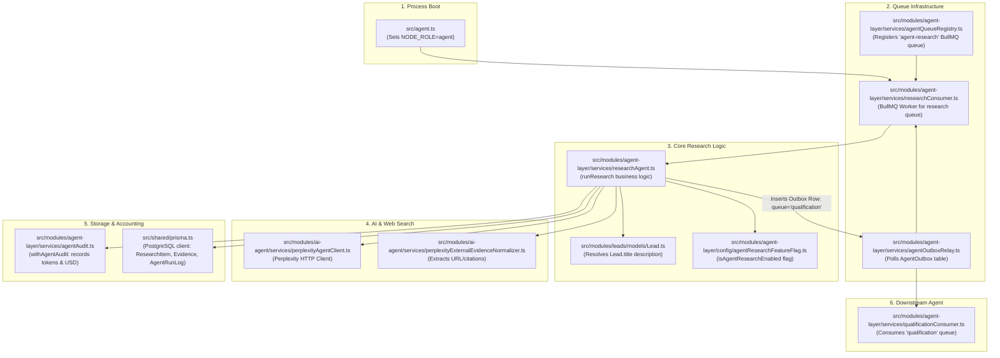
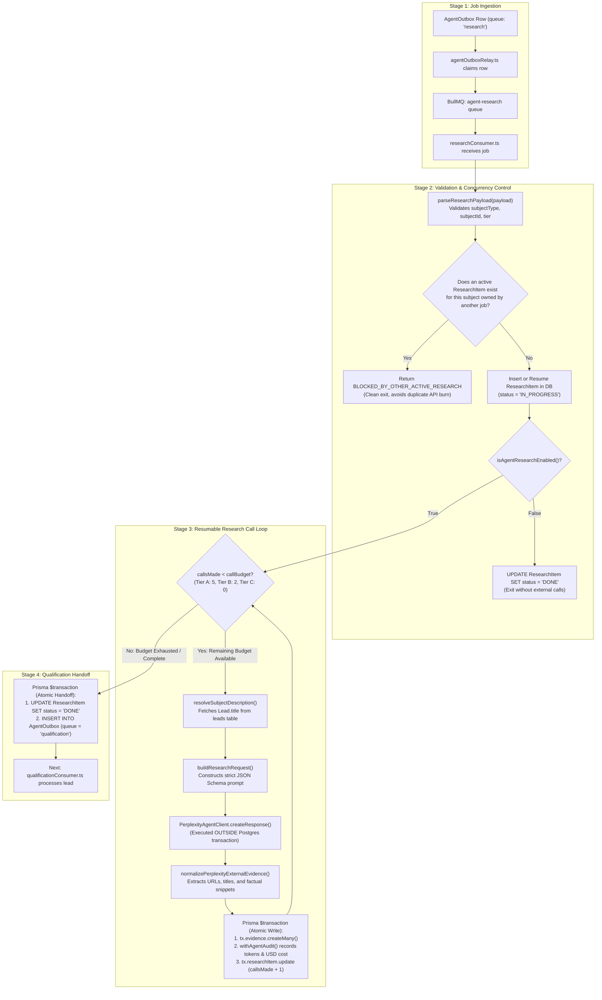

# Research Agent — Complete Architectural Deep Dive & Flow

The **Research Agent** (ticket `PPNX-803`) is the automated reconnaissance engine in Pipeclose's AI agent layer. 

Its primary purpose is to autonomously search the open web using **Perplexity AI**, retrieve fresh, factual company and contact intelligence, extract sources into durable **`Evidence`** records in PostgreSQL, audit LLM token and dollar costs, and hand off the enriched prospect to the **Qualification Agent**.

---

## Table of Contents
1. [Component Architecture & Dependency Map](#1-component-architecture--dependency-map)
2. [End-to-End Execution Flowchart](#2-end-to-end-execution-flowchart)
3. [Input Contract & Tier Budgets](#3-input-contract--tier-budgets)
4. [Step-by-Step Execution Lifecycle](#4-step-by-step-execution-lifecycle)
5. [Database Schema & Stored Artifacts](#5-database-schema--stored-artifacts)
6. [Handoff: Transitioning to the Qualification Agent](#6-handoff-transitioning-to-the-qualification-agent)
7. [Edge Cases, Breaking Points & Architectural Decisions](#7-edge-cases-breaking-points--architectural-decisions)

---

## 1. Component Architecture & Dependency Map

The Research Agent does not exist in isolation. It relies on a specific mesh of producers, queues, third-party clients, and database models.



### Key Source Files & Their Roles

| File Path | Role | Key Function / Symbol |
| :--- | :--- | :--- |
| [`src/agent.ts`](file:///Users/adityaappnox/Documents/pipeclose/pipeclose-backend/src/agent.ts) | OS Process entrypoint | `startResearchConsumer()` |
| [`src/modules/agent-layer/services/researchConsumer.ts`](file:///Users/adityaappnox/Documents/pipeclose/pipeclose-backend/src/modules/agent-layer/services/researchConsumer.ts) | BullMQ Queue Consumer | `startResearchConsumer()`, `markOwnResearchItemFailedPermanent()` |
| [`src/modules/agent-layer/services/researchAgent.ts`](file:///Users/adityaappnox/Documents/pipeclose/pipeclose-backend/src/modules/agent-layer/services/researchAgent.ts) | Pure Agent Business Logic | `runResearch()`, `buildResearchRequest()`, `TIER_BUDGETS` |
| [`src/modules/agent-layer/services/agentOutboxRelay.ts`](file:///Users/adityaappnox/Documents/pipeclose/pipeclose-backend/src/modules/agent-layer/services/agentOutboxRelay.ts) | Transactional Outbox Worker | `processAgentOutboxBatch()`, pushes to BullMQ |
| [`src/modules/ai-agent/services/perplexityAgentClient.ts`](file:///Users/adityaappnox/Documents/pipeclose/pipeclose-backend/src/modules/ai-agent/services/perplexityAgentClient.ts) | Third-Party API Client | `PerplexityAgentClient.createResponse()` |
| [`src/modules/ai-agent/services/perplexityExternalEvidenceNormalizer.ts`](file:///Users/adityaappnox/Documents/pipeclose/pipeclose-backend/src/modules/ai-agent/services/perplexityExternalEvidenceNormalizer.ts) | Citation Extractor | `normalizePerplexityExternalEvidence()` |
| [`src/modules/agent-layer/services/agentAudit.ts`](file:///Users/adityaappnox/Documents/pipeclose/pipeclose-backend/src/modules/agent-layer/services/agentAudit.ts) | Cost & Run Logger | `withAgentAudit()`, `recordCost()` |
| [`src/modules/leads/models/Lead.ts`](file:///Users/adityaappnox/Documents/pipeclose/pipeclose-backend/src/modules/leads/models/Lead.ts) | Lead Lookup | `LeadModel.findById()` |
| [`src/modules/agent-layer/config/agentResearchFeatureFlag.ts`](file:///Users/adityaappnox/Documents/pipeclose/pipeclose-backend/src/modules/agent-layer/config/agentResearchFeatureFlag.ts) | Kill Switch / Feature Flag | `isAgentResearchEnabled()` |

---

## 2. End-to-End Execution Flowchart



---

## 3. Input Contract & Tier Budgets

### The Payload Schema (`researchConsumer.ts:37-41`)

The research consumer validates that the payload has three strict properties:

```typescript
interface ResearchJobPayload {
    subjectType: string;  // e.g. "Lead"
    subjectId: number;    // e.g. 108
    tier: ResearchTier;   // "A" | "B" | "C"
}
```

### The Tier Budgets (`researchAgent.ts:46`)

To prevent runaway API bills, call volume is governed by hard-capped budgets:

```typescript
const TIER_BUDGETS: Record<ResearchTier, number> = { 
    A: 5,  // Enterprise / High-Priority Lead: up to 5 Perplexity search calls
    B: 2,  // Standard Lead: up to 2 Perplexity search calls
    C: 0   // Low-Priority / Bulk Lead: ZERO calls (immediately completes)
};
```

> **Important**: The tier budget is a hard ceiling checked *before* every HTTP call. Tier C evaluates `callsMade < 0` (false), meaning it makes zero calls and creates zero Evidence rows.

---

## 4. Step-by-Step Execution Lifecycle

### Step 1: Payload Parsing & Boundary Validation
In [`researchConsumer.ts:50-68`](file:///Users/adityaappnox/Documents/pipeclose/pipeclose-backend/src/modules/agent-layer/services/researchConsumer.ts#L50-L68):
- Ensures `subjectType` is a non-empty string.
- Ensures `subjectId` is a number.
- Ensures `tier` is one of `['A', 'B', 'C']`.
- Throws an error immediately on any malformed payload so it can be captured by the error monitoring subsystem.

### Step 2: Concurrency Lock & Unique Constraint
In [`researchAgent.ts:191-220`](file:///Users/adityaappnox/Documents/pipeclose/pipeclose-backend/src/modules/agent-layer/services/researchAgent.ts#L191-L220):
- Looks for an existing `ResearchItem` with `status: 'IN_PROGRESS'` belonging to this specific `outboxId`.
- If none exists, it attempts to insert a new `ResearchItem`.
- **Race Condition Protection**: If another process is already researching this subject, PostgreSQL throws a unique constraint violation (`P2002` on `research_item_one_active_per_subject`). The agent catches this and returns `{ outcome: 'BLOCKED_BY_OTHER_ACTIVE_RESEARCH' }` instead of failing.

### Step 3: Resolving Subject Identity
In [`researchAgent.ts:90-98`](file:///Users/adityaappnox/Documents/pipeclose/pipeclose-backend/src/modules/agent-layer/services/researchAgent.ts#L90-L98):
- Queries the database for the subject's human-readable name:
  ```typescript
  const lead = await leadModel.findById(subjectId, companyId);
  return `Lead: "${lead.title}"`; // e.g. 'Lead: "Cybersecurity Fleet Expansion"'
  ```
- If the entity was deleted or is not a `Lead`, it falls back to `Subject #108`.

### Step 4: Making the Perplexity AI Request
In [`researchAgent.ts:103-136`](file:///Users/adityaappnox/Documents/pipeclose/pipeclose-backend/src/modules/agent-layer/services/researchAgent.ts#L103-L136):
- Formats instructions: *"Research the given sales subject and return factual, sourced findings only. Do not fabricate facts."*
- Requires a strict JSON Schema response with a `summary` string.
- Converts metadata `subjectId` to a string (`String(subjectId)`) to avoid Perplexity validation rejections.

### Step 5: Atomic Persistence & Cost Accounting
In [`researchAgent.ts:263-312`](file:///Users/adityaappnox/Documents/pipeclose/pipeclose-backend/src/modules/agent-layer/services/researchAgent.ts#L263-L312):
The HTTP call finishes **outside** the database transaction. Then, inside a single atomic `prisma.$transaction`:
1. **Inserts `Evidence` rows**: Stores titles, URLs, and text snippets.
2. **Executes `withAgentAudit`**: Writes an `AgentRunLog` row containing prompt tokens, completion tokens, latency, and estimated USD cost.
3. **Updates `ResearchItem`**: Increments `callsMade` by 1 and increments `budgetTokensUsed`.

### Step 6: Atomic Qualification Handoff
In [`researchAgent.ts:315-325`](file:///Users/adityaappnox/Documents/pipeclose/pipeclose-backend/src/modules/agent-layer/services/researchAgent.ts#L315-L325):
When `callsMade >= callBudget`, a final atomic transaction commits two operations:
1. Marks `ResearchItem` as `status: 'DONE'`.
2. Inserts a new row into `AgentOutbox` targeting `queue: 'qualification'` with job name `'RESEARCH_COMPLETED'`.

---

## 5. Database Schema & Stored Artifacts

The Research Agent interacts with 4 main database tables in PostgreSQL:

### 1. `ResearchItem` (Tracks the research pass)
```sql
CREATE TABLE "ResearchItem" (
    "id" TEXT PRIMARY KEY,
    "companyId" INTEGER NOT NULL,
    "subjectType" TEXT NOT NULL,
    "subjectId" INTEGER NOT NULL,
    "outboxId" TEXT NOT NULL,
    "tier" TEXT NOT NULL,           -- 'A', 'B', or 'C'
    "callBudget" INTEGER NOT NULL,  -- 5, 2, or 0
    "callsMade" INTEGER DEFAULT 0,
    "budgetTokensUsed" INTEGER DEFAULT 0,
    "status" TEXT NOT NULL          -- 'IN_PROGRESS', 'DONE', 'FAILED_PERMANENT'
);
```

### 2. `Evidence` (The sourced findings)
```sql
CREATE TABLE "Evidence" (
    "id" TEXT PRIMARY KEY,
    "companyId" INTEGER NOT NULL,
    "researchItemId" TEXT NOT NULL REFERENCES "ResearchItem"("id") ON DELETE CASCADE,
    "sourceType" TEXT NOT NULL,     -- 'perplexity_web'
    "title" TEXT,
    "url" TEXT,
    "snippet" TEXT,
    "confidence" DOUBLE PRECISION DEFAULT 1.0
);
```

### 3. `AgentRunLog` (Audit and billing trail)
Recorded via [`agentAudit.ts`](file:///Users/adityaappnox/Documents/pipeclose/pipeclose-backend/src/modules/agent-layer/services/agentAudit.ts):
- Records `tokensIn`, `tokensOut`, and `costUsd`.
- Records latency in milliseconds.
- Records input prompts and raw model output.

### 4. `AgentOutbox` (The next queue handoff)
- Inserts a new row for the `qualification` queue upon completion.

---

## 6. Handoff: Transitioning to the Qualification Agent

The Research Agent does **not** score leads or propose deals. Its sole mission is to gather intelligence and step aside.

When research finishes:
1. It writes to `AgentOutbox` with payload:
   ```json
   {
     "subjectType": "Lead",
     "subjectId": 108,
     "researchItemId": "res_uuid_12345"
   }
   ```
2. The [`agentOutboxRelay.ts`](file:///Users/adityaappnox/Documents/pipeclose/pipeclose-backend/src/modules/agent-layer/services/agentOutboxRelay.ts) polls this row and enqueues it to `agent-qualification`.
3. The [`qualificationConsumer.ts`](file:///Users/adityaappnox/Documents/pipeclose/pipeclose-backend/src/modules/agent-layer/services/qualificationConsumer.ts) receives the job, loads the newly generated `Evidence` rows, and uses them to evaluate the prospect's **Fit Score**, **Intent Score**, and **ICP Alignment**.

---

## 7. Edge Cases, Breaking Points & Architectural Decisions

### 1. The "Lead #108" Prompt Trap
- **Vulnerability**: If the agent sends `"Research subject: Lead #108"` to Perplexity, the model halts and asks: *"Could you please clarify which company or person Lead #108 refers to?"*
- **Solution**: The agent queries `LeadModel` to retrieve the actual prospect/opportunity title (e.g. `Lead: "Acme Corp - Q4 Expansion"`).

### 2. The Perplexity Numeric Metadata 400 Bug
- **Vulnerability**: The Perplexity API schema permits metadata values of type `number`, but the live API rejects requests with `400 provider_validation_failed` if numeric values are provided.
- **Solution**: `researchAgent.ts:134` explicitly stringifies `subjectId`: `{ subjectId: String(subjectId) }`.

### 3. Database Pool Exhaustion
- **Vulnerability**: Wrapping an external AI HTTP request inside a PostgreSQL transaction holds an open database connection for 2–10 seconds. Under concurrent load, this exhausts the connection pool.
- **Solution**: The Perplexity HTTP request is made **outside** the database transaction. Only the subsequent writes to `Evidence`, `AgentRunLog`, and `ResearchItem` are wrapped in a short transaction.

### 4. Resumable Retries on Crashes
- **Vulnerability**: If a Tier A job makes 2 out of 5 calls and the process crashes, retrying from call 0 would duplicate evidence and burn 7 total API calls instead of 5.
- **Solution**: Because `callsMade` is committed to PostgreSQL after each individual call, a retry resumes from the persisted `callsMade` counter (e.g. starting at call 3).

### 5. Cleanup on Exhausted BullMQ Retries
- If all BullMQ retries fail (e.g. Perplexity API is down for an extended period), [`researchConsumer.ts:79-115`](file:///Users/adityaappnox/Documents/pipeclose/pipeclose-backend/src/modules/agent-layer/services/researchConsumer.ts#L79-L115) triggers `markOwnResearchItemFailedPermanent()`:
  - Deletes any partial `Evidence` created by this job.
  - Updates the `ResearchItem` status to `FAILED_PERMANENT`.
  - Releases the subject slot so future jobs for this lead are not blocked indefinitely.

### 6. Tenant Guarding under `NODE_ROLE=agent`
- Under `NODE_ROLE=agent`, Prisma is wrapped with [`tenantScopeGuard.ts`](file:///Users/adityaappnox/Documents/pipeclose/pipeclose-backend/src/modules/agent-layer/services/tenantScopeGuard.ts).
- Every query, update, and deletion must explicitly include `companyId: params.companyId` in the `where` clause, even on unique columns (`id`), or the runtime security guard throws an unauthorized exception.
