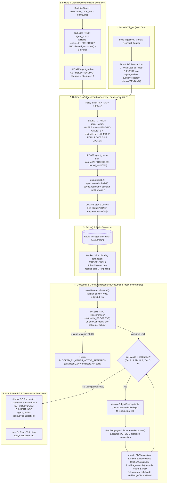

# Research Agent — End-to-End System Design & Architecture Deep Dive

The **Research Agent** (ticket `PPNX-803`) is the automated reconnaissance engine in Pipeclose's AI agent layer. 

It is designed to solve a foundational problem in sales workflows: **Gathering fresh, factual company and contact intelligence from the live web without human labor, without losing background tasks during server crashes, without exhausting database connection pools, and without runaway LLM API costs.**

---

## Table of Contents
1. [High-Level Architecture & End-to-End Flow](#1-high-level-architecture--end-to-end-flow)
2. [Phase 1: Job Ingestion & The Transactional Outbox Pattern](#2-phase-1-job-ingestion--the-transactional-outbox-pattern)
3. [Phase 2: The Outbox Relay (`agentOutboxRelay.ts`) & The Claim Mechanism](#3-phase-2-the-outbox-relay-agentoutboxrelayts--the-claim-mechanism)
4. [Phase 3: Handing Off to BullMQ & Redis (`enqueueJob.ts`)](#4-phase-3-handing-off-to-bullmq--redis-enqueuejobts)
5. [Phase 4: The Consumer (`researchConsumer.ts`) & Boundary Validation](#5-phase-4-the-consumer-researchconsumerts--boundary-validation)
6. [Phase 5: Concurrency Locking & Active Deduplication](#6-phase-5-concurrency-locking--active-deduplication)
7. [Phase 6: The Resumable Perplexity AI Call Loop](#7-phase-6-the-resumable-perplexity-ai-call-loop)
8. [Phase 7: Atomic Evidence Persistence & LLM Cost Accounting](#8-phase-7-atomic-evidence-persistence--llm-cost-accounting)
9. [Phase 8: Atomic Handoff to the Qualification Agent](#9-phase-8-atomic-handoff-to-the-qualification-agent)
10. [Crash Recovery & The Reclaim Sweeper](#10-crash-recovery--the-reclaim-sweeper)
11. [Component & Dependency Reference](#11-component--dependency-reference)

---

## 1. High-Level Architecture & End-to-End Flow



---

## 2. Phase 1: Job Ingestion & The Transactional Outbox Pattern

### The Problem it Solves: The Distributed "Dual-Write" Hazard
In an event-driven architecture, when a lead is created, the system must trigger background research. 
If your code saves the lead to PostgreSQL and then immediately calls Redis via `queue.add()`, a network blip or Redis restart will drop the job. The lead is saved, but research never happens.

### The Solution: `agent_outbox` Table
The application service writes the research intent into PostgreSQL inside the **exact same database transaction** that creates or scores the lead:

```sql
BEGIN;
  -- 1. Create or update the business entity
  INSERT INTO leads (title, company_id, ...) VALUES ('Acme Enterprise Expansion', 1, ...);

  -- 2. In the exact same transaction, write to agent_outbox
  INSERT INTO agent_outbox (
    id, 
    company_id, 
    queue, 
    job_name, 
    payload, 
    status, 
    attempts, 
    max_attempts, 
    next_attempt_at, 
    created_at, 
    updated_at
  ) VALUES (
    'd290f1ee-6c54-4b01-90e6-d701748f0851',
    1,
    'research',
    'RESEARCH_REQUEST',
    '{"subjectType": "Lead", "subjectId": 108, "tier": "A"}',
    'PENDING',
    0,
    5,
    NOW(),
    NOW(),
    NOW()
  );
COMMIT;
```

**Guaranteed Invariant**: If PostgreSQL commits, the research intent is saved on disk. It is physically impossible to lose the job.

---

## 3. Phase 2: The Outbox Relay (`agentOutboxRelay.ts`) & The Claim Mechanism

The Outbox Relay is an active loop started inside `src/agent.ts` running every **5 seconds**:
```typescript
// agentOutboxRelay.ts:34
const BATCH_SIZE = 50;
const TICK_MS = 5_000;
```

Every 5,000 milliseconds, `processAgentOutboxBatch()` calls `claimAgentOutboxBatch()`.

### The Claim SQL Query (`agentOutboxRelay.ts:83-109`)

```sql
SELECT id, company_id, queue, job_name, payload, proposal_id, attempts, max_attempts
FROM agent_outbox
WHERE status = 'PENDING'
  AND next_attempt_at <= (now() AT TIME ZONE 'UTC')
ORDER BY next_attempt_at
LIMIT 50
FOR UPDATE SKIP LOCKED;
```

#### Low-Level Mechanics of `FOR UPDATE SKIP LOCKED`:
1. **`FOR UPDATE`**: Locks the returned rows so no other process can modify or read them in a concurrent transaction.
2. **`SKIP LOCKED`**: If two worker instances poll PostgreSQL at the exact same millisecond:
   - Worker 1 locks rows 1 through 50.
   - Worker 2 does **not** wait or hang; it skips rows 1–50 and immediately claims rows 51 through 100.
   - This allows horizontal scaling across unlimited worker servers with zero lock contention.

### The Timezone Gotcha: Naive UTC vs. `timestamptz`
Notice `(now() AT TIME ZONE 'UTC')`. 
The PostgreSQL column `next_attempt_at` is stored as naive UTC (`timestamp without time zone`). If bare `now()` were used, PostgreSQL would evaluate it in the server's session timezone (e.g. `Asia/Kolkata` +5:30). A job scheduled 30 minutes in the future would read as 5 hours overdue and dispatch instantly. Explicitly casting `(now() AT TIME ZONE 'UTC')` guarantees exact microsecond accuracy.

### Stamping the Claim
Immediately within the transaction, the claimed rows are marked:
```sql
UPDATE agent_outbox 
SET status = 'IN_PROGRESS', 
    claimed_at = NOW(), 
    claimed_by = '12498' -- OS process PID
WHERE id IN ('d290f1ee-6c54-4b01-90e6-d701748f0851', ...);
```

---

## 4. Phase 3: Handing Off to BullMQ & Redis (`enqueueJob.ts`)

Once rows are claimed, the relay processes each row using the state machine in [`outboxPoller.ts`](file:///Users/adityaappnox/Documents/pipeclose/pipeclose-backend/src/shared/outbox/outboxPoller.ts).

### The Enqueue Call (`agentOutboxRelay.ts:182-196`)
```typescript
await enqueueJob(
    registry.get(job.queue), // BullMQ Queue instance for 'agent-research'
    job.job_name,            // 'RESEARCH_REQUEST'
    {
        outboxId: job.id,
        companyId: job.company_id,
        proposalId: job.proposal_id,
        payload: job.payload,
    },
    { jobId: job.id }        // CRITICAL: BullMQ jobId matches PostgreSQL outbox row ID
);
```

### What `enqueueJob.ts` Does Under the Hood
Opening [`src/shared/tracing/queue/enqueueJob.ts:21-25`](file:///Users/adityaappnox/Documents/pipeclose/pipeclose-backend/src/shared/tracing/queue/enqueueJob.ts#L21-L25):
```typescript
export async function enqueueJob<T>(queue: Queue, name: string, data: T, opts?: JobsOptions): Promise<Job<T>> {
  const ctx = getTraceContext();
  const traceId = ctx?.traceId ?? randomUUID();
  const payload = { ...data, traceId } as T & { traceId: string };

  // The actual BullMQ invocation:
  const job = await queue.add(name, payload, opts);

  logEvent({ eventType: 'job.enqueued', jobId: job.id, ... });
  return job;
}
```

1. **Distributed Tracing**: Injects a `traceId` so logs can be correlated across HTTP server, outbox relay, BullMQ, and the worker.
2. **Deduplication via `jobId: job.id`**: By pinning BullMQ's `jobId` to the `agent_outbox.id`, BullMQ's native deduplication engine will reject any duplicate push if a redelivery happens after a network hiccup.

### Finalizing the Outbox Row
- **If `queue.add()` succeeds**: The relay updates PostgreSQL:
  ```sql
  UPDATE agent_outbox SET status = 'DONE', enqueued_at = NOW() WHERE id = job.id;
  ```
- **If Redis is unreachable**: `processRow` throws an error. The outbox poller catches it, leaves the row `PENDING`, increments `attempts`, and computes exponential backoff:
  ```typescript
  // agentOutboxRelay.ts:140
  function exponentialBackoff(attempt: number): Date {
      return new Date(Date.now() + Math.min(2 ** attempt * 1_000, 10 * 60 * 1_000));
  }
  ```

---

## 5. Phase 4: The Consumer (`researchConsumer.ts`) & Boundary Validation

In `src/modules/agent-layer/services/researchConsumer.ts`, the BullMQ worker runs with configurable concurrency:
```typescript
const RESEARCH_CONCURRENCY = parseInt(process.env.AGENT_RESEARCH_CONCURRENCY || '5', 10);
```

### Zero-CPU Waiting on Redis Sockets
The worker does **not** query Redis every few seconds. BullMQ maintains a persistent, open TCP socket to Redis using blocking commands (`BRPOPLPUSH` / `XREAD BLOCK`). 
When idle, the worker thread sleeps. The instant Redis receives the job from Phase 3, Redis pushes the job payload over the socket, waking up the worker in sub-milliseconds.

### Boundary Validation (`researchConsumer.ts:50-68`)
Before executing any business logic, `parseResearchPayload()` verifies the untyped JSON payload:
- `subjectType` must be a non-empty string.
- `subjectId` must be a valid integer.
- `tier` must be one of `['A', 'B', 'C']`.

```typescript
interface ResearchJobPayload {
    subjectType: string;
    subjectId: number;
    tier: 'A' | 'B' | 'C';
}
```

---

## 6. Phase 5: Concurrency Locking & Active Deduplication

Once the consumer calls `runResearch()` in [`researchAgent.ts`](file:///Users/adityaappnox/Documents/pipeclose/pipeclose-backend/src/modules/agent-layer/services/researchAgent.ts), the agent must prevent two simultaneous workers from researching the same subject.

### The `ResearchItem` Concurrency Guard (`researchAgent.ts:203-220`)
```sql
INSERT INTO "ResearchItem" (
    "id", 
    "companyId", 
    "subjectType", 
    "subjectId", 
    "outboxId", 
    "tier", 
    "callBudget", 
    "status"
) VALUES (
    gen_random_uuid(), 
    1, 
    'Lead', 
    108, 
    'd290f1ee...', 
    'A', 
    5, 
    'IN_PROGRESS'
);
```

The database enforces this partial unique index:
```sql
CREATE UNIQUE INDEX research_item_one_active_per_subject 
ON "ResearchItem"("companyId", "subjectType", "subjectId") 
WHERE status = 'IN_PROGRESS';
```

If another worker is already actively researching Lead #108, PostgreSQL throws error **`P2002` (Unique constraint violation)**.
The code catches `P2002`:
```typescript
// researchAgent.ts:215-218
if (isUniqueConstraintViolation(err)) {
    return { outcome: 'BLOCKED_BY_OTHER_ACTIVE_RESEARCH' };
}
```
The second worker halts immediately and exits cleanly. Zero wasted API credits.

---

## 7. Phase 6: The Resumable Perplexity AI Call Loop

### The Tier Budget Ceilings (`researchAgent.ts:46`)
```typescript
const TIER_BUDGETS: Record<ResearchTier, number> = { A: 5, B: 2, C: 0 };
```
- **Tier A**: Maximum **5** calls.
- **Tier B**: Maximum **2** calls.
- **Tier C**: **0** calls. If tier is C, `while (callsMade < 0)` is false; it makes zero external calls.

### Avoiding the "Lead #108" Clarification Trap
Perplexity is an AI web search engine. If you prompt it with:
> *"Research subject: Lead #108"*

The AI will output: *"Could you please specify which company or executive Lead #108 refers to?"*
To prevent this, `resolveSubjectDescription()` performs a pre-flight lookup:
```typescript
// researchAgent.ts:90-98
if (subjectType === 'Lead') {
    const lead = await leadModel.findById(subjectId, companyId);
    if (lead !== null) {
        return `Lead: "${lead.title}"`; // e.g. Lead: "Acme Corp Enterprise Expansion"
    }
}
return `${subjectType} #${subjectId}`;
```

### The Perplexity HTTP Request
```typescript
// researchAgent.ts:239
const response = await perplexityClient.createResponse(request);
```

### Architectural Guard: Keeping HTTP Outside Database Transactions
The call to `perplexityClient.createResponse()` takes between **2,000ms and 6,000ms**. 
It is executed **completely outside** any PostgreSQL transaction. 
If an engineer wrapped this network call in a `prisma.$transaction`, 5 concurrent research jobs would occupy 5 PostgreSQL connections for 6 full seconds, causing database connection starvation for the entire application.

---

## 8. Phase 7: Atomic Evidence Persistence & LLM Cost Accounting

Once Perplexity returns the JSON payload and web citations, the agent opens a short, high-speed **5-millisecond** PostgreSQL transaction ([`researchAgent.ts:263-312`](file:///Users/adityaappnox/Documents/pipeclose/pipeclose-backend/src/modules/agent-layer/services/researchAgent.ts#L263-L312)):

```typescript
await prisma.$transaction(async (tx) => {
    // 1. Insert normalized external citations
    if (evidenceRows.length > 0) {
        await tx.evidence.createMany({ data: evidenceRows });
    }

    // 2. Record billing and token audit
    await withAgentAudit({ ... }, async (audit) => {
        audit.recordCost({
            tokensIn: response.usage?.input_tokens ?? null,
            tokensOut: response.usage?.output_tokens ?? null,
            usd: response.usage?.cost?.total_cost ?? null,
        });
        return {
            evidenceIds: evidenceRows.map((row) => row.id),
            structuredOutput: { output: response.output },
            ...
        };
    });

    // 3. Increment the persistent counter
    await tx.researchItem.update({
        where: { id: researchItemId, companyId: params.companyId },
        data: { 
            callsMade: capturedCallsMade, 
            budgetTokensUsed: { increment: response.usage?.total_tokens ?? 0 } 
        },
    });
});
```

### Resumable Retries on Crash
Because `callsMade` is saved to PostgreSQL after **every single Perplexity call**:
If a Tier A job finishes Call 1 and Call 2, and then the worker process crashes during Call 3, BullMQ will re-deliver the job.
On retry, the agent reads `callsMade = 2` from `ResearchItem`. It **does not start over from Call 1**; it immediately resumes at Call 3.

---

## 9. Phase 8: Atomic Handoff to the Qualification Agent

When `callsMade >= callBudget`, the loop completes. The Research Agent does not score the lead or make sales decisions. It executes a final, atomic handoff transaction ([`researchAgent.ts:315-325`](file:///Users/adityaappnox/Documents/pipeclose/pipeclose-backend/src/modules/agent-layer/services/researchAgent.ts#L315-L325)):

```typescript
await prisma.$transaction([
    // 1. Mark research complete
    prisma.researchItem.update({
        where: { id: researchItemId, companyId: params.companyId },
        data: { status: 'DONE' }
    }),

    // 2. Insert handoff into agent_outbox for the Qualification Agent
    prisma.agentOutbox.create({
        data: {
            companyId: params.companyId,
            queue: 'qualification',
            jobName: 'RESEARCH_COMPLETED',
            payload: { 
                subjectType: params.subjectType, 
                subjectId: params.subjectId, 
                researchItemId 
            },
        },
    }),
]);
```

On the very next 5-second tick of the Outbox Relay (Phase 2), this `qualification` row will be claimed and handed over to BullMQ's `agent-qualification` queue!

---

## 10. Crash Recovery & The Reclaim Sweeper

What happens if a worker claims an outbox row (`status = 'IN_PROGRESS'`) and the operating system kills the process (`kill -9`, out of memory, or server power loss)?

The row is stuck in `IN_PROGRESS`. Normal relay claims only query `status = 'PENDING'`, so this task would remain orphaned forever.

### The Reclaim Sweep (`agentOutboxRelay.ts:253-330`)
A background watchdog runs every **60 seconds**:
```typescript
const RECLAIM_TICK_MS = 60_000;
const STALE_CLAIM_MS = 5 * 60_000; // 5 minutes threshold
```

It executes this SQL sweep:
```sql
SELECT id, company_id
FROM agent_outbox
WHERE status = 'IN_PROGRESS'
  AND (claimed_at < (now() - INTERVAL '5 minutes')
       OR (claimed_at IS NULL AND updated_at < (now() - INTERVAL '5 minutes')))
LIMIT 500;
```

It resets any leaked claim back to `PENDING`:
```sql
UPDATE agent_outbox
SET status = 'PENDING',
    attempts = attempts + 1,
    claimed_at = NULL,
    claimed_by = NULL,
    last_error = 'claim leaked — reclaimed by sweep'
WHERE id IN (...);
```

Because BullMQ deduplicates jobs using `jobId = row.id`, re-enqueuing a reclaimed row cannot create duplicate executions.

### Cleanup on Exhausted Retries (`researchConsumer.ts:79-115`)
If all BullMQ retries are exhausted (e.g. Perplexity API is down for 30 minutes), `markOwnResearchItemFailedPermanent()` fires:
1. Deletes any partial `Evidence` rows attached to this attempt.
2. Updates `ResearchItem` status to `FAILED_PERMANENT`.
3. Releases the active subject lock so future manual or scheduled triggers for this lead are not blocked.

---

## 11. Component & Dependency Reference

| Component | File Path | Direct Callers / Dependencies |
| :--- | :--- | :--- |
| **Process Entrypoint** | [`src/agent.ts`](file:///Users/adityaappnox/Documents/pipeclose/pipeclose-backend/src/agent.ts) | Boots the relay and registers the 6 BullMQ consumers under `NODE_ROLE=agent`. |
| **Outbox Relay** | [`src/modules/agent-layer/services/agentOutboxRelay.ts`](file:///Users/adityaappnox/Documents/pipeclose/pipeclose-backend/src/modules/agent-layer/services/agentOutboxRelay.ts) | Polls `agent_outbox` every 5s (`TICK_MS`), reclaims leaked claims every 60s (`RECLAIM_TICK_MS`). |
| **Outbox Poller Engine** | [`src/shared/outbox/outboxPoller.ts`](file:///Users/adityaappnox/Documents/pipeclose/pipeclose-backend/src/shared/outbox/outboxPoller.ts) | Implements batch claiming, error classification, and state transitions (`DONE` vs. `PENDING`). |
| **BullMQ Enqueue Wrapper** | [`src/shared/tracing/queue/enqueueJob.ts`](file:///Users/adityaappnox/Documents/pipeclose/pipeclose-backend/src/shared/tracing/queue/enqueueJob.ts) | Wraps `queue.add()`, mints distributed `traceId`, and logs telemetry `job.enqueued`. |
| **Research Consumer** | [`src/modules/agent-layer/services/researchConsumer.ts`](file:///Users/adityaappnox/Documents/pipeclose/pipeclose-backend/src/modules/agent-layer/services/researchConsumer.ts) | BullMQ worker for `agent-research` queue; validates payloads and handles failure cleanup. |
| **Research Business Logic** | [`src/modules/agent-layer/services/researchAgent.ts`](file:///Users/adityaappnox/Documents/pipeclose/pipeclose-backend/src/modules/agent-layer/services/researchAgent.ts) | Executes `runResearch()`, enforces tier budgets, and coordinates the Perplexity AI loop. |
| **Perplexity AI Client** | [`src/modules/ai-agent/services/perplexityAgentClient.ts`](file:///Users/adityaappnox/Documents/pipeclose/pipeclose-backend/src/modules/ai-agent/services/perplexityAgentClient.ts) | HTTP client communicating with Perplexity API with strict JSON Schema formatting. |
| **Evidence Normalizer** | [`src/modules/ai-agent/services/perplexityExternalEvidenceNormalizer.ts`](file:///Users/adityaappnox/Documents/pipeclose/pipeclose-backend/src/modules/ai-agent/services/perplexityExternalEvidenceNormalizer.ts) | Extracts cited web URLs, titles, and snippets into standard `Evidence` records. |
| **Agent Run Logger & Cost** | [`src/modules/agent-layer/services/agentAudit.ts`](file:///Users/adityaappnox/Documents/pipeclose/pipeclose-backend/src/modules/agent-layer/services/agentAudit.ts) | Records token usage, latency, model versions, and USD expenditure into `AgentRunLog`. |
| **Downstream Receiver** | [`src/modules/agent-layer/services/qualificationConsumer.ts`](file:///Users/adityaappnox/Documents/pipeclose/pipeclose-backend/src/modules/agent-layer/services/qualificationConsumer.ts) | Consumes the `RESEARCH_COMPLETED` job from `AgentOutbox` to calculate Fit and Intent scores. |
